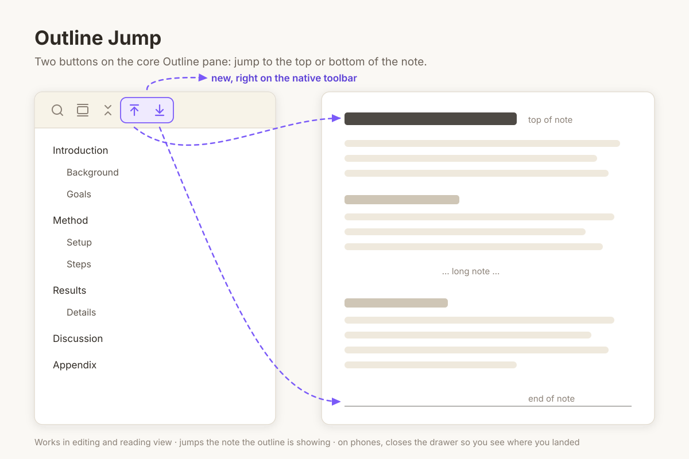

# Outline Jump

The core Outline pane lets you jump to any heading, but not to the very top or
the very bottom of the note. On a long note that means a lot of scrolling.

This plugin adds two buttons to the Outline pane's own toolbar, next to search
and collapse:

- **Jump to top** — scrolls the note back to its first line.
- **Jump to bottom** — scrolls the note all the way to the end.

## Details

- Works in both **editing** and **reading** view. Reading view renders long
  notes lazily, so the bottom jump keeps going until it really reaches the end.
- It jumps the note the **outline is currently showing**, so it does the right
  thing with split panes.
- On **phones** the outline lives in a drawer that covers the note, so the
  drawer closes after a jump and you see where you landed.
- Only scrolls. It never moves your cursor or changes the note.

## Install

Search for **Outline Jump** in Settings → Community plugins, or copy `main.js`
and `manifest.json` from the latest release into
`<vault>/.obsidian/plugins/outline-jump/`.

The core **Outline** plugin needs to be enabled.

## License

MIT
